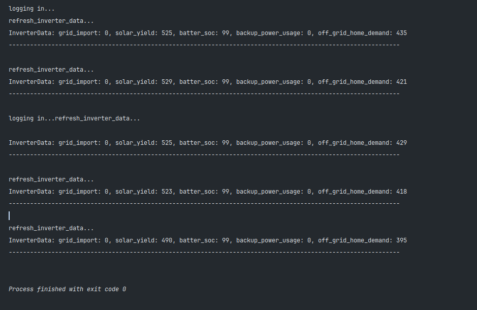

# Inverter Guard

- Monitors your LuxPower stats and turns off devices that should not be used while in backup power mode.

## Requirements:

- LuxPower inverter
- LuxPower wifi dongle
- Any brand smart wifi plug
- HomeAssistant
- Docker

## Run script
- Run with Docker:
  - Build image: 
    - `docker build -t inverter-guard:latest`
  - Run container: 
    - `docker run inverter-guard`
## Preview
